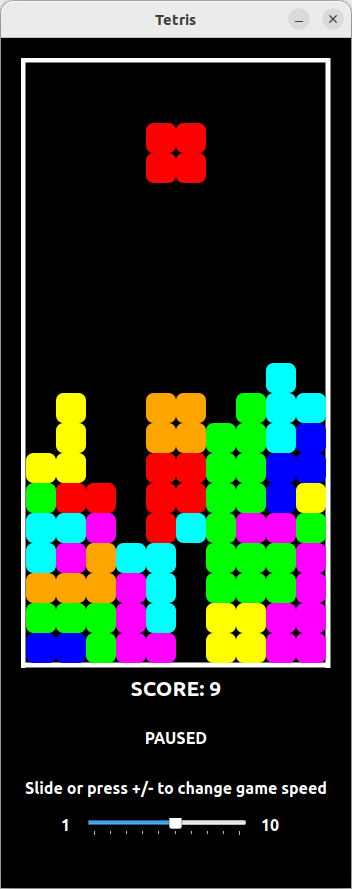

# Tetris
C++ implementation of classic Tetris game using Qt 6.2.4 library.

**Windows and Linux executables are provided.**

# Tests
Unit tested using Google Test 1.11.0

# How to run on Windows
1. Download and unzip **executable_windows.zip** located in **Releases**
2. Run **executable_windows/Tetris.exe**

# How to run on Linux
1. Download and unzip **executable_linux.zip** located in **Releases**
2. Run **executable_linux/Tetris.sh**

# How to run using Docker (on Linux host)
Run **Tetris.sh** located in main directory

This requires running Docker service. It builds and runs Docker image based on provided dockerfile. The image is based on my prebuilt image "adamchor/ubuntu-image-for-qt-gui" which is available on my Docker Hub. It is actually an Ubuntu image with preinstalled libraries required for running Qt GUI applications on Linux.

**Warning**\
Due to the fact that this is a GUI application, the Docker container needs to acquire access to host's display. In this case it is done by adding "local:docker" to xhost access control to enable Docker connection to X Server.

## Remarks
- Adjust speed slider or press num +/- to increase/decrease game speed.
